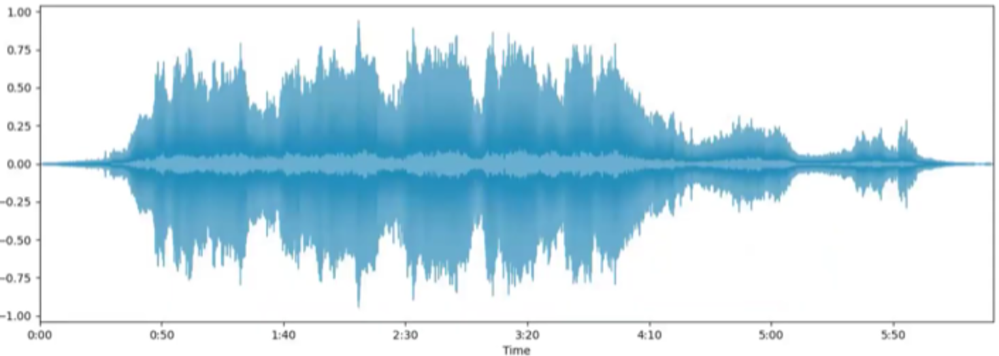
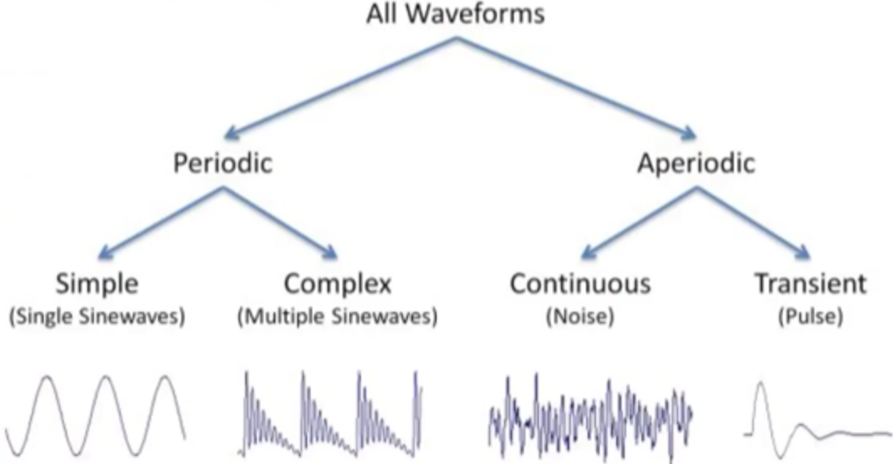
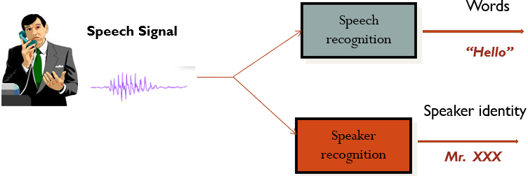

[Check Fake/Real News](https://toolbox.google.com/factcheck/explorer)

## 📑 Table of Contents

- [Audio Forensic](#audio-forensic)
  - [Mechanism of Voice Generation](#mechanism-of-voice-generation)
  - [Production of Speech](#production-of-speech)
  - [Speaker Recognition](#speaker-recognition)
  - [Method of Speaker Identification](#methods-of-speaker-identification)
  - [Audio Examination Tools](#audio-examination-tools)
  - [Challenge in Audio Processing](#challenge-in-audio-processing)
  - [Analysing Audio as a Investigator](#analysing-audio-as-a-investigator)
    - [Audio Authentication](#audio-authentication)
- [Video Forensic](#video-forensic)
---

# Audio Forensic: vid[1.1](https://youtu.be/QsopUPy5nvs?si=ENvUMMDLWUopGU4E),[1.2](https://youtu.be/iz-xPlradnU?si=io7LjWE4k-zUJWZb),[1.3](https://youtu.be/Ljn2A6MfCW4?si=r0SHfx9AvWPoOUxw),[1.4](https://youtu.be/K2hyRz9IYQs?si=MuSwezlE-qoiSKIz),[1.5](https://youtu.be/3VTfU0LTUy4?si=1YC7wIvn6-WlVwQr); [vid2](https://youtu.be/qQhB5uDQQCU?si=Q8PHxLQMLOVsj9xO)
- Sound can be visualized in waveform. waveform can be seen with tools like `Audacity`.
 

- Parameter of Audio Signals: Frequency, Amplitude, Phase, Intensity, pitch, Loudness, etc
- 2 types of Audio Signals: Analog & Digital

| ADC | DAC |
|---|---|
|||

### Mechanism of Voice Generation

| SEPEAKER | LISTENER |  
|---|---|  
| `Production of vibrational energy` by `articulation` after brain instructs to perform | `Eardrums` convert this vibrational energy into signals that travel along nerves to the brain, which `interprets` them as `voices`, `music`, `noise`, etc. |

### Production of Speech

- The basic responsible function for production of speech are: `Generation of air pressure`, `regulation of vibration`, and `control of resonators`.
- Larynx sometimes called `voice box` is the most important  organ among Lung, Vocal code, pharynx, Tongue, Teeth & Lip etc. Tongue is also the valuable articulatory organ.

Place of Articulation
| | |  
|---|---| 
|1. Exo-labial, 2. Endo-labial, 3. Dental, 4. Alveolar, 5. Post-alveolar, 6. Pre-palatal, 7. Palatal, 8. Velar, 9. Uvular, 10. Pharyngeal, 11. Glottal, 12. Epiglottal, 13. Radical, 14. Postero-dorsal, 15. Antero-dorsal, 16. Laminal, 17. Apical, 18. Sub-apical||

Why animal can’t produce speech
- because they don’t have `co-articulation system`

Why person to person different in voice ?
- As  `vocal tracks` are differ in `shape`, `size` and `length` and the tension of the vocal folds, the voice production is also different to person to person

### Speaker Recognition

- The process of automatically recognizing who is speaking on the basis of individual’s speech signals information.
- It is divided into two categories:
  - `Speaker Identification`: The task of determining an unknown speaker’s identity. (Speaker identification determines which registered speaker provides a given utterance from amongst a set of known speakers.)
  - `Speaker Verification`: With certain identity the voice is used to verify (Speaker verification accepts or rejects the identity claim of a speaker - is the speaker the person they say they are? )
> In forensic applications, it is suggested to first perform a speaker identification process to create a list of "best matches" and then perform a series of verification processes to determine a conclusive match

Why Speaker Identification ?
- Speaker Identification is essential for several criminal offences, such as making hoax calls to the police, ambulance or fire brigade, making threatening or harassing telephone calls, blackmail or extortion demands, or taking part in criminal conspiracies such as those involving the importation, trafficking or manufacture of illegal drugs etc.

What's Possibilities in Speaker Identification?
- Determine the speaker identity
- Selection b/w a set of known voices
- The user doesn't claim an identity
- `closed set identification`: the task of identifying an unidentified speaker within a known database.
  - Assume that all speakers are known to the system
- `Open set identification`: the task of identifying a known speaker within the unknown database.
  - Possibility that speaker is not among the speakers known to the system

Where forensic Audio is important?
- Kidnapping for ransom
- Anonymous calls, threatening calls
- Obscene calls
- Drug peddling
- Sharing of vital information across the border
- Bribery
- Match fixing .... etc

Problems in Forensic speaker examination
- Recorded Samples
  - Noisy (SNR 5-6db or less)
  - Distorted/Damped & short duration
  - Non-contemporary
  - Disguised
  - Different texts
- Mode of Recording: Telephone, Cellular phone, Tape recorder, ....etc
> Noise ARE THE ENEMY OF THE SPEECH SAMPLE!

### Methods for Speaker Identification
- Auditory/Aural examination Method
- Spectrographic visual analysis method via
  - Computerized Speech Laboratory (CSL)
  - Multi-Speech
- Automatic Speaker identification System via
  - Text Independent Speaker Identification System (SPID)
  - Language Independent Speaker Identification System (LISIS)

### Audio Examination Tools
- Audio High-End Professional System
- Digitization Tools
  - Professional Audio System
- Pre analysis tools
  - Audacity, Adobe Audition, Praat, Hash Calc, Sonic Visualizer etc.
- Analysis Software
  - Computerized speech Lab, Multispeech etc.
  - Semi Automatic SPID

### Challenges in Audio Processing
- `Noise`: Unwanted sound makes extraction and analysis harder.
- `Aliasing & Quantization Errors`: Bad sampling/poor bit depth reduces fidelity.
- `Loss of Information`: Compression and downsampling can discard important details.
- `Subjectivity in Loudness/Pitch Perception`: Variability in human listeners means technical measurements don't always match perception.

### Analysing Audio as a Investigator
- Authenticity
- Enhancement
- Interpretation
- Critical Listening
- Visual Inspection
- Analyzing Metadata

### Audio Authentication
- Pre-Examination Assesment
  - Always request the original recording or original device.
  - If unavailable, request details of recording device: make, model, serial number; date, time of copying; details of copying process.
  - For telephone recordings, request Call Detail Records (CDR) for data verification like length of the recording, time, date and etc.
  - Maintain and check Chain Of Custody Documents (COD).
- Laboratory Examination
  - Judge Source: Direct or Telephonic Recording ?? 

| Factor | Telephonic Recording | Direct Recording | 
|---|---|---|
|Sampling Rate|8000 Hz|23000 Hz or more|
|Background Noise|Low|High|
|Metadata/Hex|[md5](https://md5file.com/calculator)||

`Waveform Analysis`
- Visual comparison to spot discontinuities, sharp cuts, or faces that don’t match up.
- Difficult to detect if edits are made with technical precision (phase-aligned cutting).
- Human vs. synthesized/AI voice detection:
  - Human speech naturally exhibits variation; synthesized or programmatic voice segments show near-identical waveforms repeatedly.

`Spectrographical Analysis`
- Visualizes frequency content over time.
- Look for abrupt frequency changes or repeated patterns
- Sudden start/stop bands suggest edits or synthetic content

`Spectrogram Analysis`

`DC Shift Analysis`
- Measures whether the center line of the waveform is offset from zero.
- Large DC offset = improper recording or editing

`Statistical Parameters`
- Skewness, Kurtosis: indicate amplitude distribution shape
- SNR (Signal-to-Noise Ratio): higher = clearer audio

`Silence/Zero Discontinuity Detection`
- Checks for unnatural silences or zero blocks.
- Natural speech pauses differ from hard cuts or inserted silences

`LPC (Linear Predictive Coding) Discontinuity`
- Analyzes prediction changes over time.
- Discontinuities = possible splicing
- 'No discontinuity found' = likely original audio

`ENF (Electric Network Frequency) Variation`
- Checks continuity of 50Hz power line hum.
- Absence or sudden change may suggest manipulation

`Sampling Frequency Detection`
- Confirms audio sampling rate (e.g., 44.1kHz).
- Mismatch may indicate resampling or re-encoding

Specific Scenarios for Authentication & Appropriate Techniques
|Audio File Scenario|Techniques|Outcome|
|---|---|---|
|Original file on original device like mobile phone|Metadata, Hash|Conclusive authentication possible|
|File copied to another device, but original available like cd or pendrive with souce|Metadata, Hash, Auditory, waveform form, Spectrograph|String opinion possible|
|file only CD/drive, not social media processed|Metadata, Auditory, waveform-form, spectrography|continuity only|
|File from social media but present in device|Mostly Auditory, waveform form, Spectrograph|Only continuity possible|

