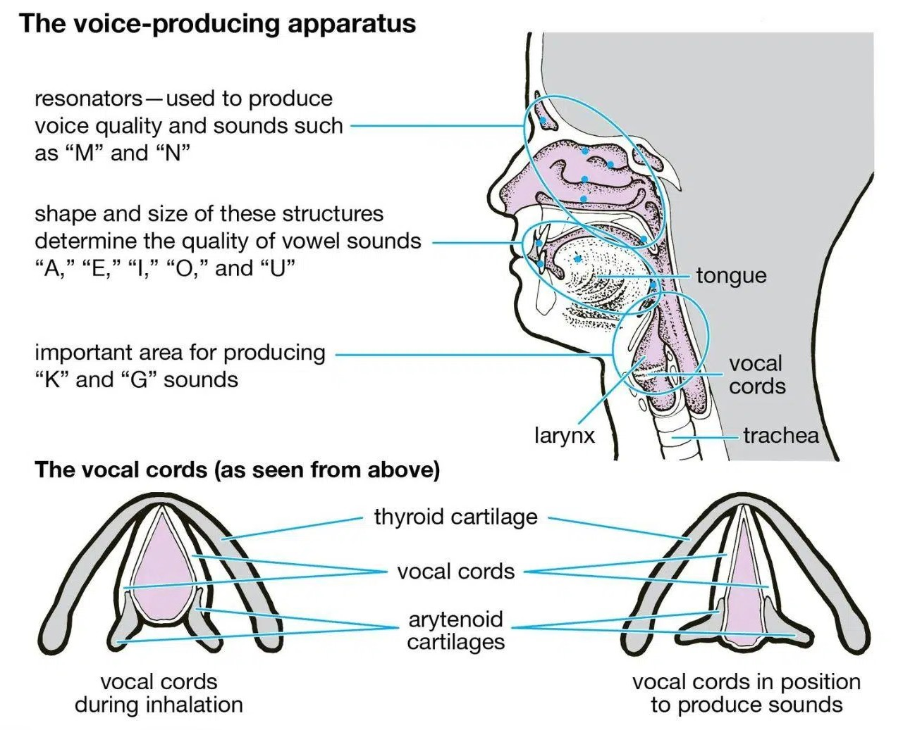

## Audio Forensic: [vid1](https://youtu.be/qQhB5uDQQCU?si=Q8PHxLQMLOVsj9xO), vid2
[Check Fake/Real News](https://toolbox.google.com/factcheck/explorer)

# Mechanism of Voice Generation

| SEPEAKER | LISTENER |  
|---|---|  
| `Production of vibrational energy` by `articulation` after brain instructs to perform | `Eardrums` convert this vibrational energy into signals that travel along nerves to the brain, which `interprets` them as `voices`, `music`, `noise`, etc. |

Production of Speech

- The basic responsible function for production of speech are: `Generation of air pressure`, `regulation of vibration`, and `control of resonators`.
- Larynx sometimes called `voice box` is the most important  organ among Lung, Vocal code, pharynx, Tongue, Teeth & Lip etc. Tongue is also the valuable articulatory organ.

Place of Articulation
| | |  
|---|---| 
|1. Exo-labial, 2. Endo-labial, 3. Dental, 4. Alveolar, 5. Post-alveolar, 6. Pre-palatal, 7. Palatal, 8. Velar, 9. Uvular, 10. Pharyngeal, 11. Glottal, 12. Epiglottal, 13. Radical, 14. Postero-dorsal, 15. Antero-dorsal, 16. Laminal, 17. Apical, 18. Sub-apical||

Why animal can’t produce speech
- because they don’t have `co-articulation system`

Why person to person different in voice ?
- As  `vocal tracks` are differ in `shape`, `size` and `length` and the tension of the vocal folds, the voice production is also different to person to person

Speaker Identification

Speaker Recognition
- The process of automatically recognizing who is speaking on the basis of individual’s speech signals information.
- It is divided into two categories:
  - `Speaker Identification`: The task of determining an unknown speaker’s identity. (Speaker identification determines which registered speaker provides a given utterance from amongst a set of known speakers.)
  - `Speaker Verification`: With certain identity the voice is used to verify (Speaker verification accepts or rejects the identity claim of a speaker - is the speaker the person they say they are? )
> In forensic applications, it is suggested to first perform a speaker identification process to create a list of "best matches" and then perform a series of verification processes to determine a conclusive match

Why Speaker Identification ?
- Speaker Identification is essential for several criminal offences, such as making hoax calls to the police, ambulance or fire brigade, making threatening or harassing telephone calls, blackmail or extortion demands, or taking part in criminal conspiracies such as those involving the importation, trafficking or manufacture of illegal drugs etc.

What's Possibilities in Speaker Identification?
- Determine the speaker identity
- Selection b/w a set of known voices
- The user doesn't claim an identity
- `closed set identification`: the task of identifying an unidentified speaker within a known database.
  - Assume that all speakers are known to the system
- `Open set identification`: the task of identifying a known speaker within the unknown database.
  - Possibility that speaker is not among the speakers known to the system

What's Process of Speaker Identification ?

Where forensic Audio is important?
- Kidnapping for ransom
- Anonymous calls, threatening calls
- Obscene calls
- Drug peddling
- Sharing of vital information across the border
- Bribery
- Match fixing .... etc

Problems in Forensic speaker examination
- Recorded Samples
  - Noisy (SNR 5-6db or less)
  - Distorted/Damped & short duration
  - Non-contemporary
  - Disguised
  - Different texts
- Mode of Recording: Telephone, Cellular phone, Tape recorder, ....etc
> Noise ARE THE ENEMY OF THE SPEECH SAMPLE!

Methods for Speaker Identification
- Auditory/Aural examination Method
- Spectrographic visual analysis method via
  - Computerized Speech Laboratory (CSL)
  - Multi-Speech
- Automatic Speaker identification System via
  - Text Independent Speaker Identification System (SPID)
  - Language Independent Speaker Identification System (LISIS)

Audio Examination Tools
- Audio High-End Professional System
- Digitization Tools
  - Professional Audio System
- Pre analysis tools
  - Audacity, Adobe Audition, Cool Edit etc.
- Analysis Software
  - Computerized speech Lab, Multispeech etc.
  - Semi Automatic SPID

Information Obtain from Audio
- Message Spoken
- Sex of the Speaker
- Language Spoken
- Geographical Origin
- Level of Origin
- Religion
- Physical & Emotional State
- Identity of the Speaker
Distinctiveness in voice
- it refers to the unique characteristics that make a voice recognizable and identifiable.

